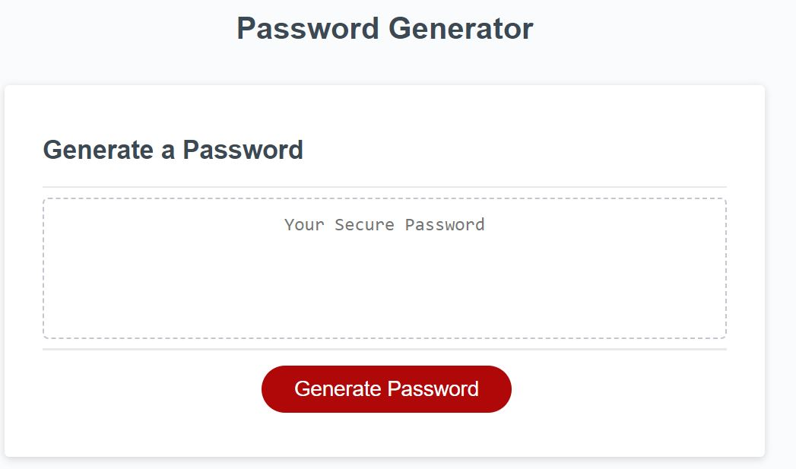
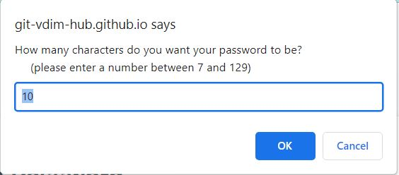
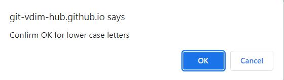
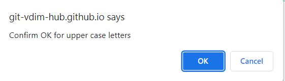
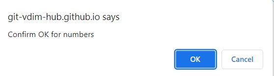
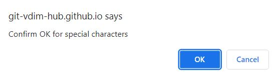
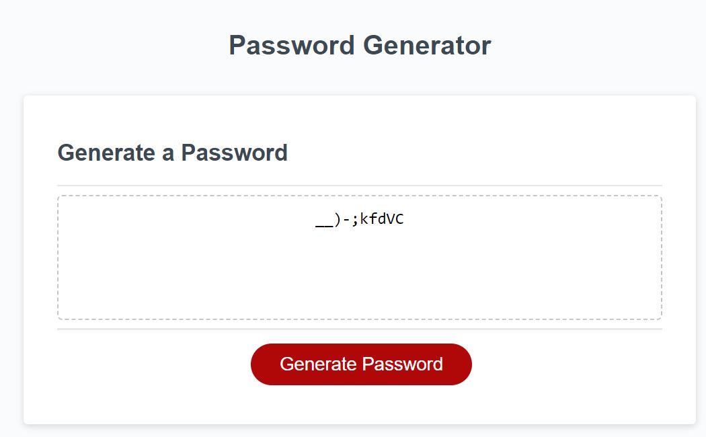

# js-password-generator

## Description

 - This project generates a random password in your browser window based on four criteria: character count ( between 8 and 128), upper case letters (yes/no), lower case letters (yes/no), numbers (yes/no), and special characters (yes/no). 
 - After selecting all criteria, the user is given a password based on that criteria. 
 - The motivation for this project was based on an interest in sharpening my development skills in Java Script in the following topics: arrays, loops, functions, event listeners, strings, and methods. 
 - Additionally understanding the random method within math. Additionally, strong passwords are an important part of any secure account.

## Installation

No additional steps are required to deploy this project.

## Usage

Navigate to the webpage: [Password Generator](https://git-vdim-hub.github.io/js-password-generator/)

Follow the prompts (select a number between 8 and 128), choose if you would like to use upper case letters, lower case letters, numbers and/or special characters

## Credits

Used Javascript Password Generator bt Paul Keldsen Video as starting point:
https://youtu.be/x4HUaiazDes

## Features

- numbers
- letters (upper case)
- letters (lower case)
- special characters

## Tests

- test characters outside the bounds: less than 8 greater than 128 or cancel (should re-prompt)
- test selecting all no for the choices (should reprompt boolean choices)
- should see letters a-z lower case and upper case during testing
- should see numbers 0-9 during testing
- should see the following special chracters: "!",'"',"#","$","%","&","'","(",")","*","+",",","-",".","/",":",";","<","=",">","?","@","[","]", "^","_", "`", "{", "|", "}", "~"